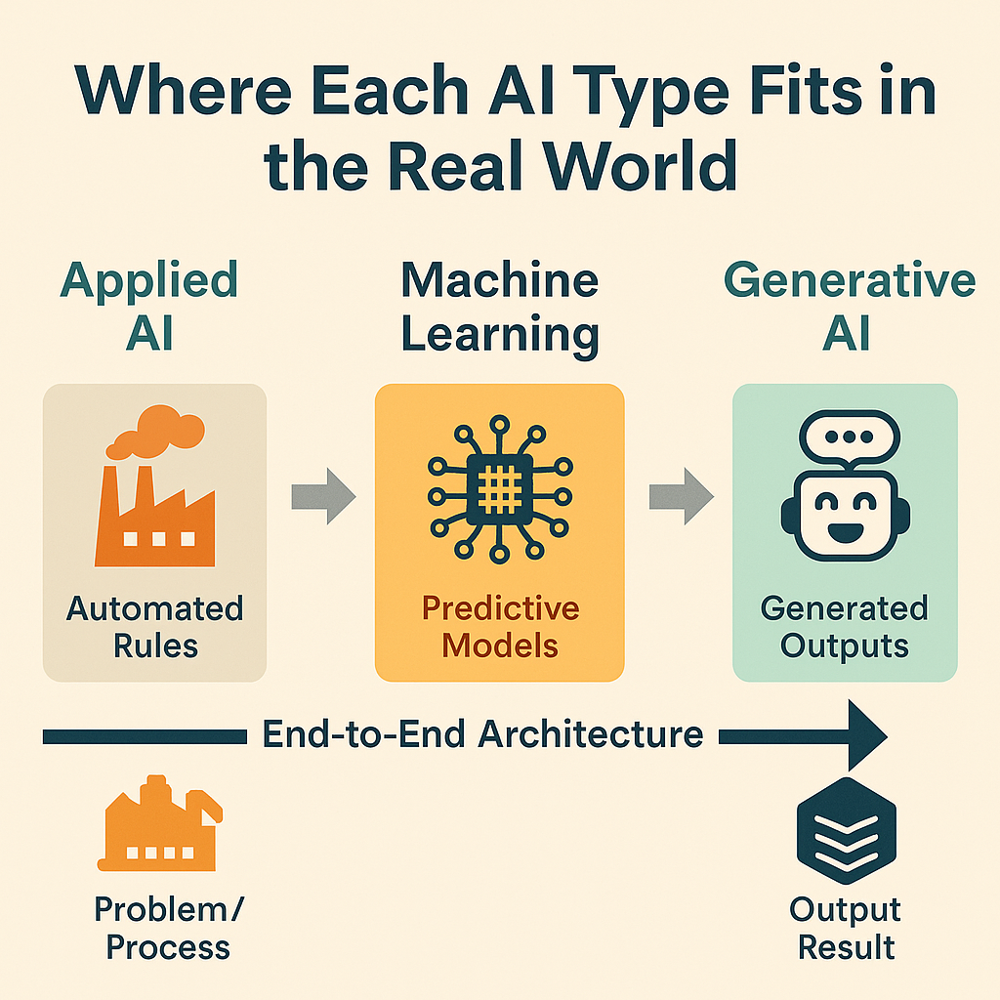
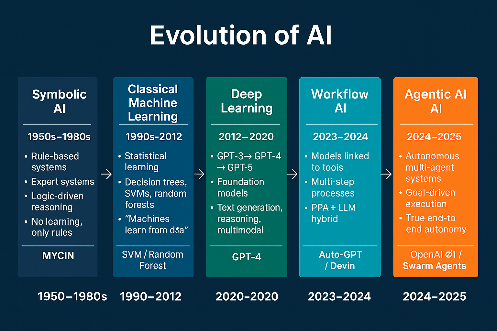
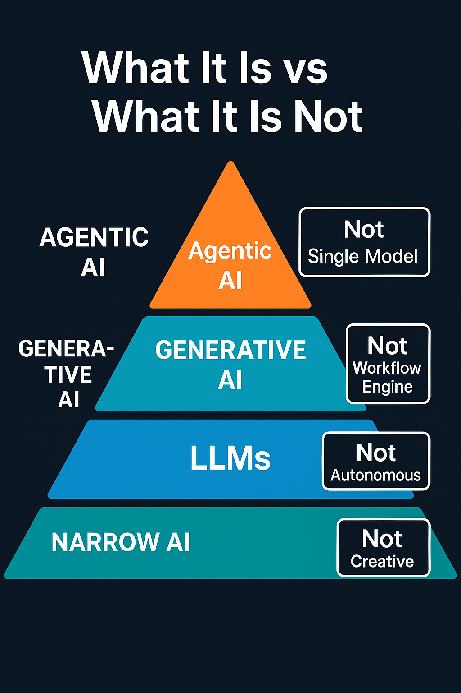
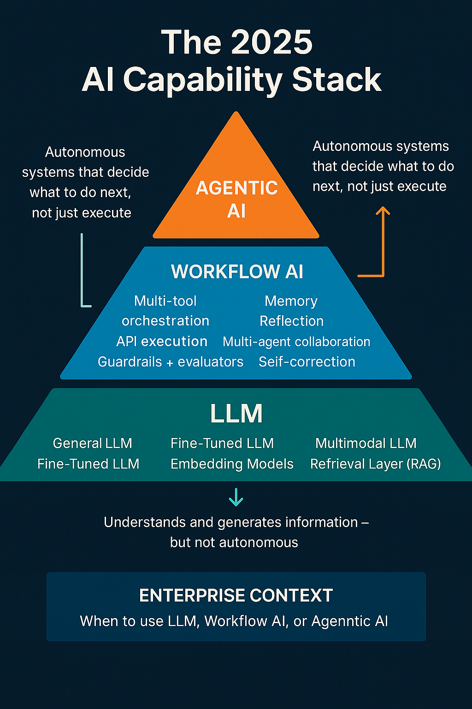

# AI Insights

A collection of exploratory notes and visual explanations about modern artificial intelligence, including large language models (LLMs), workflow AI, agentic systems and enterprise AI.

The aim is to make changing AI concepts easier to compare and discuss. These materials are conceptual learning aids rather than expert research, formal taxonomies or production AI engineering guidance.

## Topics

- how different forms of AI relate to practical problems;
- the role of LLMs and generative AI;
- workflow orchestration, tools and guardrails;
- agentic-system concepts and degrees of autonomy; and
- questions organisations should consider when applying AI in an enterprise context.

## Visual concepts

### AI types in real-world context

An introductory comparison of applied AI, predictive machine learning and generative AI within an end-to-end process.

### Evolution of AI

A simplified timeline showing a progression from symbolic systems and classical machine learning toward workflow and agentic approaches.

### AI capability layers

A visual distinction between narrow AI, LLMs, generative AI and agentic AI, with emphasis on what each layer should not automatically be assumed to provide.

### LLM, workflow AI and agentic AI stack

An exploratory capability stack connecting language models, tool-enabled workflows and more autonomous agentic behaviour with enterprise context.

## A note on interpretation

AI terminology changes quickly, and boundaries between these categories are not universally agreed. The visuals are discussion aids: they simplify complex ideas and should be read alongside current technical documentation, governance requirements and the specific business problem being considered.

## Author

**Veera Babu Tiragatla**

- [LinkedIn](https://www.linkedin.com/in/veerababutiragatla)
- [Website](https://www.veerababutiragatla.com)
- [Tech Insights](https://github.com/VeeraBabuTiragatla/tech-insights)
